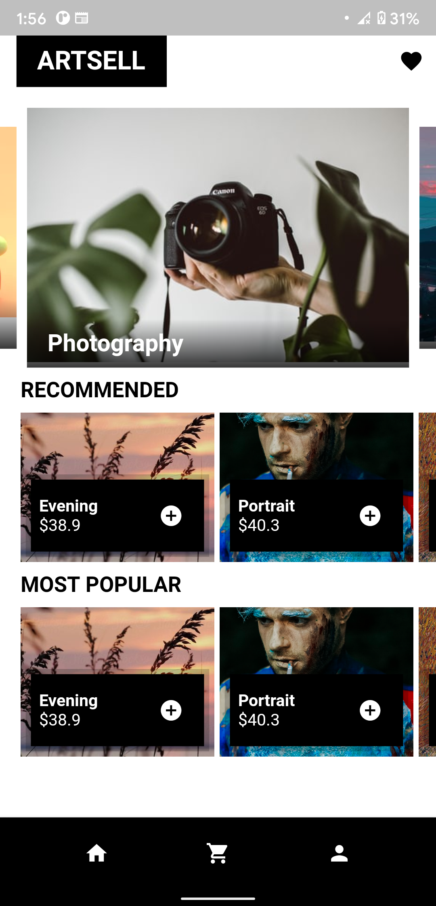
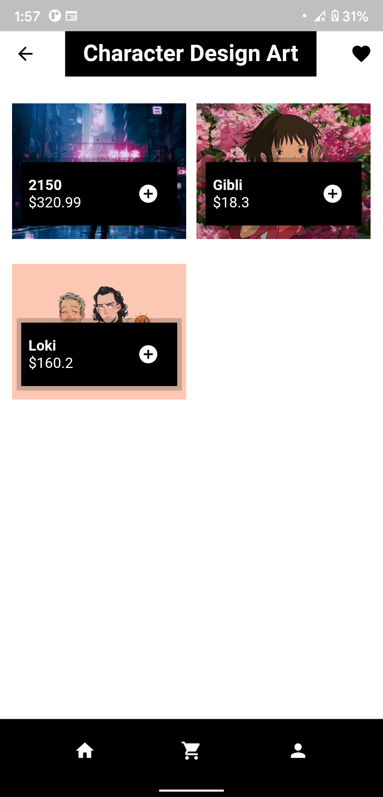
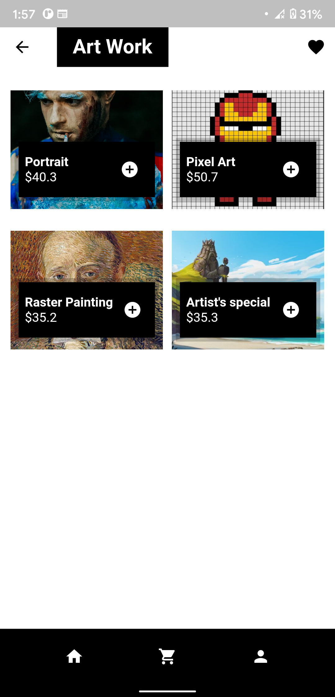
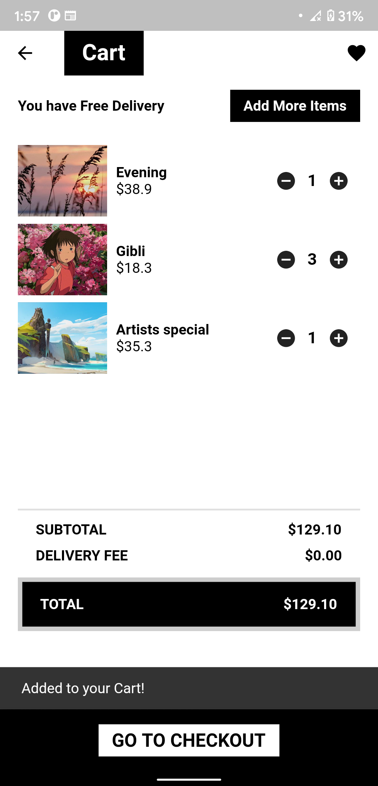
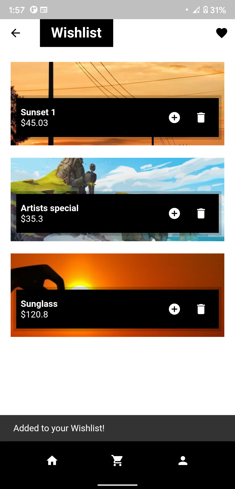
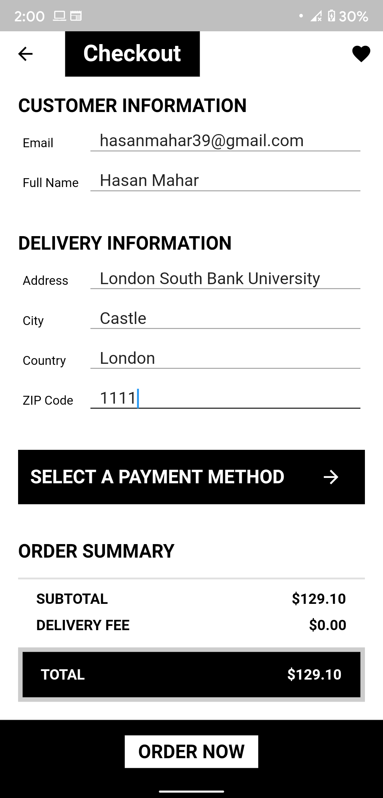
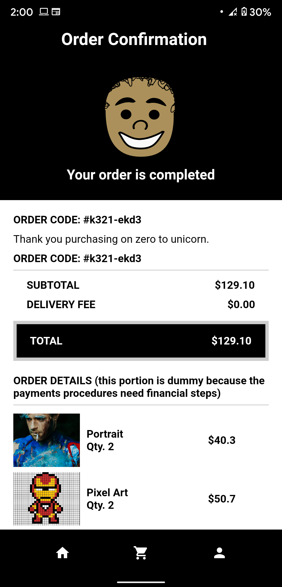
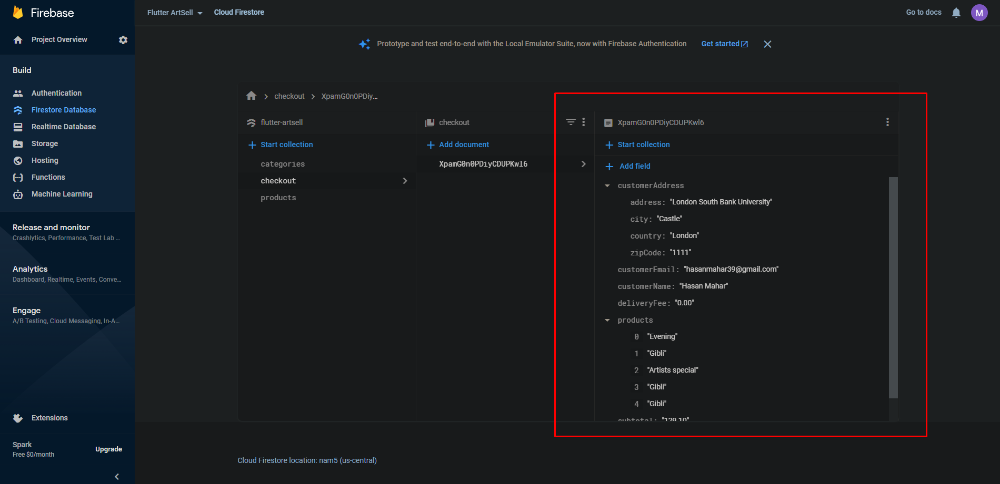

<h2>ARTSELL</h2>

### <b>Project development details</b>

<br/>

## Problem definition

I am a digital artist. I recently found out lots of people like my arts and want to purchase high quality prints form me directly. So, I want to develop a personal cross platform app (android/iOS) by flutter which will demonstrate my digital arts and their print quality towards my audiences. Through the app he will be able to get benefitted financially and showcase my skills.

<br/>

## Project description and objectives

<ul>
<li>A Responsive UI for Users</li>
<li>Catagorical Sort of Art works</li>
<li>Discounted packages</li>
<li>Popular packages</li>
<li>Adding in cart</li>
<li>Adding favorite artwork in your wishlist</li>
<li>Simple client information checkout</li>
</ul>
</br>

## Used Technologies:

<ul>
<li>software development kit (SDK): <b>Flutter</b></li>
<li>Language: <b>Dart</b></li>
<li>Database: <b>Firebase</b></li>
</ul>

<br/>

## To run the project in your machine

clean flutter project first:

```
flutter clean
```

clear pub caches

```
flutter pub cache repair
```

Install the dependencies

```
flutter pub get
```

Now [set up your firebase](https://firebase.google.com/docs/flutter/setup?platform=android) and add [category](lib\models\category_model.dart) and [product](lib\models\category_model.dart) in firebase database collection. Then install Android emulator, open it and run in your terminal.

```
flutter run
```

## Some Screenshots:

<p float="left">
  
  
  
</p>
<p float="left">
  
  
  
</p>
<p float="left">
  
</p>



<br/>
